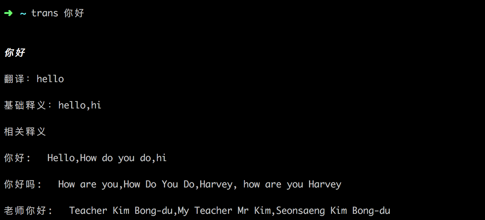
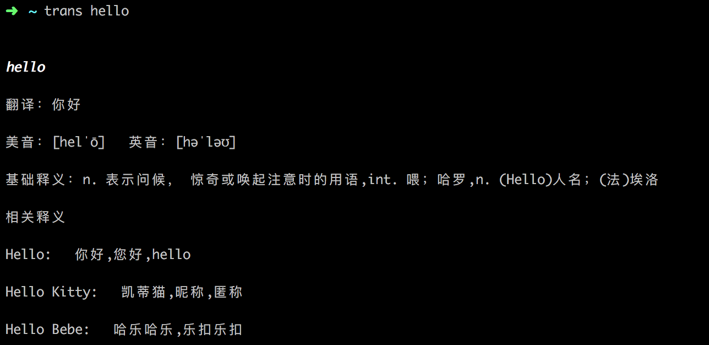

# Command Line Translation Tool

## Requirements
* Python 3.5+
* Works on Linux,Mac OSX
## Installation

```shell
$ pip install ptrans
```


## Usage
```shell
$ trans [word] {parameters}
```

## Examples
The default is to translate Chinese into English. If the input is not Chinese, it is translated into Chinese.
You can add the parameters in the following example to translate Chinese into other languages.

```shell
$ trans 你好
$ trans 你好 -e
$ trans 你好 --english
```

translate into Japanese
```shell
$ trans 你好 -j
$ trans 你好 --japanese
```

translate Japanese into Chinese
```shell
$ trans こんにちは
```

translate other supported language
```shell
-e --english      English
-j --japanese     Japanese
-k --koran        Korean
-f --franch       Franch
-p --portuguesa   Portuguesa
-es --espana      Espana
```
## Screenshots





